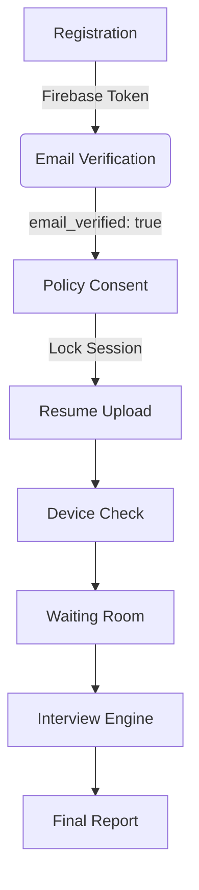

# Ravengard AI Recruiter - Project Specification (PROJECT_SPEC.md)

## 1. Project Overview
Ravengard AI Recruiter is an AI-powered B2B interview screening platform. It replaces human first-round interviews by deploying an AI that provides a ranked, evidence-backed shortlist of candidates (including full transcripts, scorecards, and integrity reports). Secondary benefits include candidate interview practice and a personalized learning roadmap.

## 2. Product Goal
To deliver a single locked, automated pipeline (resume intelligence → structured multi-persona interview → scored evaluation → ranked recommendation) that serves as a defensible, auditable first-pass filter for hiring teams.

## 3. Phase Breakdown
*   **Phase 1 — Foundation (COMPLETED):** Locked candidate onboarding core. Registration, Welcome screen, Policy consent, Locked session creation, Resume upload/parsing, Session recovery, Route guarding.
*   **Phase 2 — Device Check (COMPLETED):** Validates candidate device readiness. Camera/mic permissions, speaker test, browser check, fallback handling, session persistence for readiness.
*   **Phase 3 — Waiting Room (NEXT/PENDING):** Controlled holding stage before the interview. Post-device-check waiting state, auto-transition setup, readiness confirmation.
*   **Phase 4 — Interview Engine (PENDING):** Actual interview experience. Auto-start, stage sequencing, round logic, response capture.
*   **Phase 5 — Anti-Cheat / Integrity Layer (PENDING):** Suspicious behavior detection, integrity signals, cheat-risk tracking, fallback alerts.
*   **Phase 6 — Final Report (PENDING):** Score generation, summary report, strengths/gaps, structured output.
*   **Phase 7 — Admin Access (PENDING):** Separate admin portal. Login, RBAC, candidate/session review, internal dashboards.

## 4. User Flow
1. **Registration:** User enters details (Name, Email, Phone, College, etc.).
2. **Email Verification:** User receives Firebase Auth verification link.
3. **Welcome/Consent:** User verifies email and accepts policy. Session is created and **locked**.
4. **Resume Upload:** Candidate uploads resume. AI parses it.
5. **Device Check:** Hardware capabilities are requested and verified.
6. **Waiting Room:** Final holding area before the AI begins.
7. **Interview:** Candidate interacts with AI interviewer.
8. **Completion:** Candidate sees a completion state; Recruiter receives Final Report.

## 5. Route Map
**Frontend Routes (Strictly Gated):**
*   `/` (Registration / Welcome based on token)
*   `/consent` (Requires Email Verification)
*   `/resume` (Requires Consent)
*   `/device-check` (Requires Resume)
*   `/waiting-room` (Requires Device Check)
*   `/interview` (Requires Waiting Room clearance)

**Backend API Map:**
*   `POST /api/register` - Validates and creates candidate, sends Firebase verification email.
*   `GET /api/me` - Fetches candidate, active session, and merges live Firebase `email_verified` token claim.
*   `POST /api/session/confirm-consent` - Verifies email, creates locked session, sets `thinkAgainUsesLeft: 2`.
*   `POST /api/session/:id/think-again` - Decrements think-again counter. Validates ownership and remaining uses.

## 6. Database Schema (Core Entities)
*   **Candidates:** `id`, `email`, `name`, `mobile`, `college`, `degree`, `gradYear`, `preferredLanguage`.
*   **Sessions:** `id`, `candidateId`, `locked` (boolean), `consentAcceptedAt`, `policyVersion`, `currentStage` (enum matching phases), `status`, `thinkAgainUsesLeft` (int, default 2).
*   **ResumeAnalyses:** `id`, `sessionId`, `rawResumeText`, `parsedData`.

## 7. Component Inventory
*   `Registration.tsx`: Form with Zod validation.
*   `Welcome.tsx`: Polls for `email_verified`, handles consent transition.
*   `auth.ts` (Backend Middleware): Parses Firebase token, injects `req.user`, enforces environment-based E2E bypass (`test-uid-*`).

## 8. UI States and Error States
*   **Verification Pending:** UI physically blocks progression, shows "Email Verification Required" shield alert.
*   **Think-Again Depleted:** API returns 400 "No think-agains left", UI disables the action.
*   **Invalid Token:** Middleware returns 401 Unauthorized, frontend logs user out.

## 9. Fallback Rules
*   If Firebase verification email fails to send natively, log warning but do not crash candidate creation (so manual intervention can occur).
*   If permissions are blocked in Phase 2, show explicit recovery steps (e.g., "How to enable camera in Chrome") before allowing retry.

## 10. Testing Strategy
*   Strict enforcement of `NODE_ENV=production` for real token validation.
*   E2E test environments use `test-uid-*` bypass for automated flow testing.

## 11. Acceptance Criteria (Gate Rules)
*   **No jumping phases:** The system strictly checks `sessions.currentStage` against the requested route.
*   **Source of truth:** The backend Firebase token is the ultimate source of truth for auth/email states; frontend state is purely derived from backend responses.
*   **Persistence:** Every critical transition (Consent -> Resume -> Device Check) must write to the database before the UI updates.

## 12. Flowchart (Mermaid)

## 13. Open Questions (Ambiguities)
*   **Waiting Room Auto-transition:** What exact signal triggers the move from Waiting Room to Interview? (Is it a timed countdown, an AI backend ready-signal, or a manual "I am ready" button click?)
*   **Interview Engine Tech Stack:** Are we using WebSockets, WebRTC, or simple HTTP polling for the AI conversation in Phase 4?
