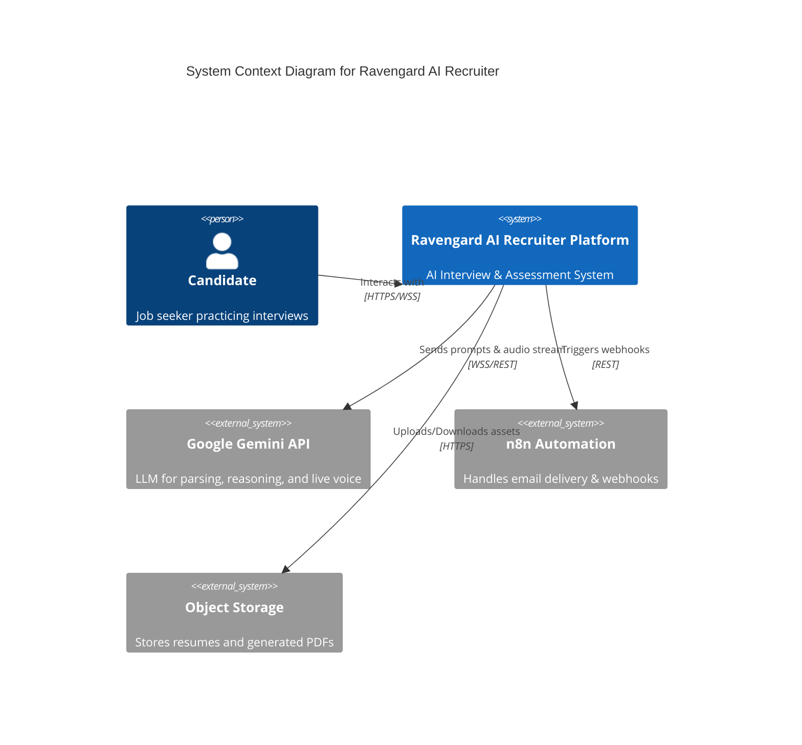

# Ravengard AI Recruiter - System Architecture Document (SAD)

## 1. System Overview
Ravengard AI Recruiter uses a decoupled, event-driven architecture designed to balance fast UI rendering with intensive background AI inference. It leverages a modern TypeScript stack (React/Vite for frontend, Express for backend) integrated tightly with Google's Gemini AI services.

## 2. Context Diagram

## 3. Container/Service Breakdown
- **Frontend App (React/Vite):** 
  - Handles routing, global state (Zustand/Context), and UI components.
  - Manages WebRTC (`getUserMedia`) for mic/camera.
  - Maintains the WebSocket connection for the live interview phase.
- **API Gateway / Backend (Express.js):**
  - Serves as a secure proxy to AI services (hiding API keys).
  - Handles business logic: session state machine, file upload parsing, anti-cheat logging.
- **Database (PostgreSQL via Drizzle ORM):**
  - Relational storage for candidates, sessions, transcripts, and telemetry.
- **AI Engine (Gemini 1.5 Pro & Live API):**
  - **Standard API:** Used for resume parsing, ATS scoring, and final report generation.
  - **Live API (WebSocket):** Used strictly for the Phase 4 real-time conversational interview rounds.

## 4. Frontend Architecture
- **Component Pattern:** strict functional components with hooks.
- **State Management:** 
  - Local state for ephemeral UI (form inputs, loaders).
  - Global context for `SessionState` (current round, hints left, cheat violations).
- **Anti-Cheat Listeners:** Hooks attached to `window` for `visibilitychange`, `blur`, and `resize`.

## 5. Backend Architecture
- **Monolithic API Structure:** All routes mounted under `/api/v1/*`.
- **Controllers:** 
  - `authController`: registration and UUID generation.
  - `resumeController`: file upload buffer handling, text extraction (pdf-parse), AI invocation.
  - `interviewController`: state transitions, "Think Again" logic, round progression.
  - `reportController`: Puppeteer/PDFKit generation, triggering n8n.

## 6. AI Service Architecture
- **Resume & ATS (Asynchronous):** Backend receives file, extracts text, sends a large prompt to Gemini 1.5 Pro requiring a strict JSON schema output.
- **Live Interview (Streaming):** Frontend captures audio, sends to Backend (or directly to Gemini via secure short-lived token, depending on implementation). Backend orchestrates the system instructions dynamically per round (e.g., swapping from "HR Interviewer" persona to "Technical Interviewer").

## 7. Data Flow: Interview Round
1. Frontend requests next round start `POST /api/session/{id}/round/{n}`.
2. Backend loads candidate context and previous answers from DB.
3. Backend generates dynamic system instructions and initiates Gemini Live API session.
4. WebSocket opens. Candidate speaks -> Audio streamed -> Gemini processes -> Audio/Text streamed back -> Frontend plays audio.
5. Upon candidate saying "I'm done" or timer expiry, transcript is finalized and saved to `answers` table.

## 8. Security Model
- **Authentication:** UUID-based sessions (JWT or secure HttpOnly cookies).
- **API Protection:** No external API keys exposed to the client. Rate limiting applied per session IP.
- **Data Sanitization:** Resumes are parsed in memory. AI prompt injection mitigation via strict system prompt boundaries.

## 9. Session Lifecycle & Error Handling
- **State Machine:** `REGISTERED` -> `RESUME_PARSED` -> `READY` -> `INTERVIEWING` -> `COMPLETED`.
- **Recovery:** If the browser crashes, the user can re-enter their email/session ID. The backend returns the last known state from the `sessions` table, resuming at the exact round they left off.
- **Error Strategy:** 
  - `4xx`: Client input errors (bad file type, missing fields) -> Show toast notification.
  - `5xx`: AI timeouts or DB failures -> Show graceful "Reconnecting..." UI and retry with exponential backoff.

## 10. Scaling & Deployment
- **Deployment:** Dockerized Express app on AWS ECS / Google Cloud Run. Static React build served via CDN (Vercel/Cloudflare).
- **Scaling Strategy:** Node.js backend scales horizontally. WebSocket connections require sticky sessions or Redis adapter if load balancing across multiple instances.

---
**Documentation Ownership:** Engineering Lead  
**Change Control:** v1.0 - Initial Architecture Draft
