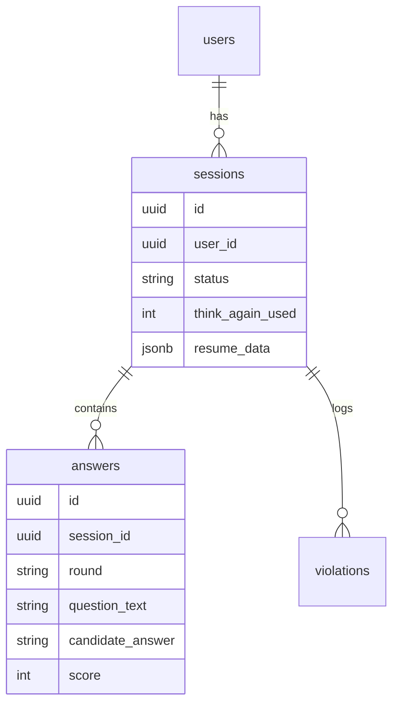

# Traineer - Database Schema

## 1. Entity Relationship Diagram

## 2. Table Definitions
- **users:** Stores candidate profile, email, and college details.
- **sessions:** Tracks the lifecycle of an interview (resume upload -> waiting room -> rounds -> complete).
- **answers:** Stores the history of generated questions, candidate responses, and round evaluations.
- **violations:** Logs anti-cheat triggers (e.g., tab switching).

## 3. Migration Strategy
- Drizzle ORM is used for schema definitions and migrations (`src/db/schema.ts`).
- Migrations are run incrementally during CI/CD.
