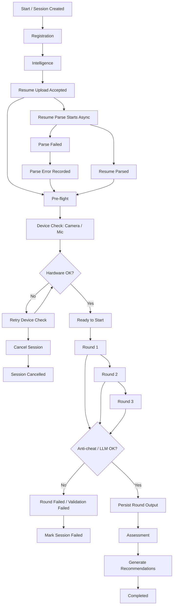

# Ravengard Full Track Flow Diagram

```mermaid
flowchart TD
  A[Start / Session Created] --> B[Registration]
  B --> C[Intelligence]
  C --> D[Resume Upload Accepted]
  D --> E[Resume Parse Starts Async]
  D --> F[Pre-flight]

  E --> G[Resume Parsed]
  E --> H[Parse Failed]

  F --> I[Device Check: Camera / Mic]
  I --> J{Hardware OK?}
  J -- Yes --> K[Ready to Start]
  J -- No --> L[Retry Device Check]
  L --> J
  L --> M[Cancel Session]
  M --> N[Session Cancelled]

  K --> O[Round 1]
  O --> P[Round 2]
  P --> Q[Round 3]

  O --> R{Anti-cheat / LLM OK?}
  P --> R
  Q --> R

  R -- Yes --> S[Persist Round Output]
  R -- No --> T[Round Failed / Validation Failed]
  T --> U[Mark Session Failed]

  S --> V[Assessment]
  V --> W[Generate Recommendations]
  W --> X[Completed]

  H --> Y[Parse Error Recorded]
  Y --> F

  G --> F
```
